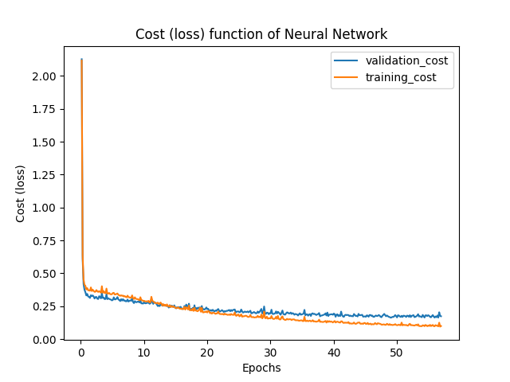

# Sieć neuronowa

Na potrzeby projektu użyłem sieci neuronowej z akceleracją Nesterova (którą zaimplementowałem rok temu na potrzeby przedmiotu Sztuczna Inteligencja), regularyzacją L2, funkcją aktywacji sigmoid oraz funkcją straty cross entropy. Udało mi się osiągnąć 96.62% dokładności na zbiorze testowym po wytrenowaniu sieci z następującymi hipeparametrami:
 - `eta=0.01` (krok)
 - `lmbda=0.1` (regularyzacja)
 - `mi=0.0` (akceleracja - niezbyt przydatna)
 - `epochs=~50`
 - `#training_set` : `#validation_set` : `#test_set` = 0.6 : 0.1 : 0.3
 - wszystkie obserwacje były przeskalowane

Doboru hiperparametrów dokonałem kolejno, to jest: wyzerowałem `mi` oraz `lmbda` i pobawiłem się `eta`. Najlepszy rezultat otrzymałem dla `eta=0.01`. Z zafiksowanym `eta` znalazłem najlepsze `lmbda`, a następnie `mi`. 

