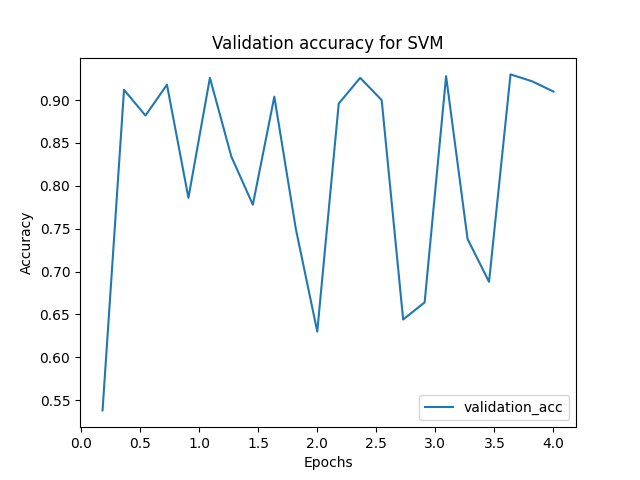

# SVM

Zaimplementowałem SVM z jądrem gaussowskim, która używa [uproszczonej wersji algorytmu SMO](http://cs229.stanford.edu/materials/smo.pdf). Udało mi się osiągnąć 92.85% dokładności na zbiorze testowym po wytrenowaniu SVM z następującymi hiperparametrami:
- `t=4` (hiperparametr jądra gaussowskiego)
- `C=2` (górne ograniczenie parametrów alfa)
- `epochs=~4` (liczba iteracji głównej pętli)
- `#training_set` : `#validation_set` : `#test_set` = 0.6 : 0.1* : 0.3

Ze względów wydajnościowych ograniczyłem `validation_set` do 500 próbek oraz zrezygnowałem z obliczania funkcji celu na rzecz obliczania dokładności na zbiorze walidacyjnym. Ponadto odgórnie ustaliłem liczbę iteracji, ponieważ aglorytm zbiega się bardzo długo, a uproszczona wersja SMO nie daje gwarancji, że się to kiedykolwiek uda.

Wyboru hiperparametrów dokonałem kolejno:nNajpierw wybrałem najbardziej obiecujący `t`, a następnie `C`. Krzywa uczenia dla powyższych hiperparametrów wygląda następująco:

# Sieć neuronowa

Na potrzeby projektu użyłem sieci neuronowej z akceleracją Nesterova (którą zaimplementowałem rok temu na potrzeby przedmiotu Sztuczna Inteligencja), regularyzacją L2, funkcją aktywacji sigmoid oraz funkcją straty cross entropy. Udało mi się osiągnąć 96.62% dokładności na zbiorze testowym po wytrenowaniu sieci z następującymi hipeparametrami:
 - `eta=0.01` (krok)
 - `lmbda=0.1` (regularyzacja)
 - `mi=0.0` (akceleracja - niezbyt przydatna)
 - `epochs=~50`
 - `#training_set` : `#validation_set` : `#test_set` = 0.6 : 0.1 : 0.3
 - wszystkie obserwacje były przeskalowane

Doboru hiperparametrów dokonałem kolejno, to jest: wyzerowałem `mi` oraz `lmbda` i pobawiłem się `eta`. Najlepszy rezultat otrzymałem dla `eta=0.01`. Z zafiksowanym `eta` znalazłem najlepsze `lmbda`, a następnie `mi`. Krzywa uczenia się dla powyższych hiperparametrów wygląda następująco:

